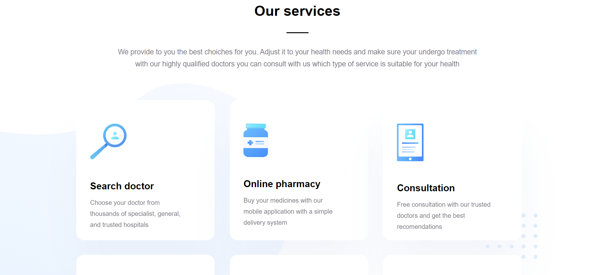
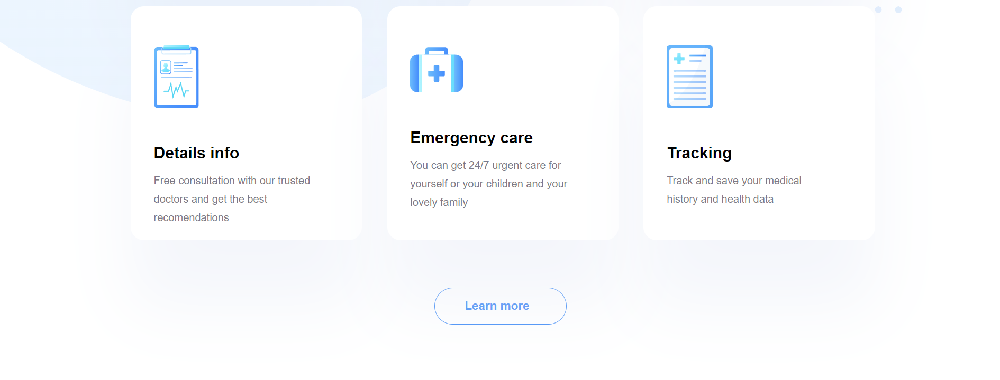
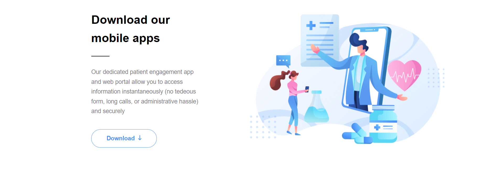
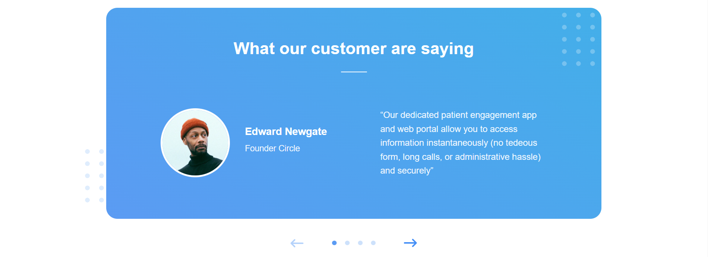
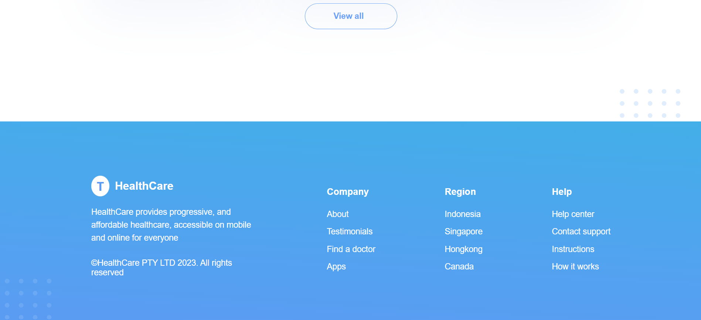

# digital_department_react

## Описание проекта
Это проект экрана приложения, написанный на React c использованием TypeScript. На экране присутствуют следующие элементы:

- **Логотип**: Логотип и название сайте.
- **Навигация**: Панель навигации по сайту.
- **Сервисы**: Сервисы предоставляемые сайтом.
- **Отзывы**: Отзывы об услугах сайта.
- **Статьи**: Различные статьи сайта.
- **Нижний колонтитул**: Нижний колонтитул с информацией.
- **Заголовки**: Заголовки всех структур.

## Структура проекта
- **`Check`**: Все карточки со статьями.
- **`Articles`**:  Несколько карточек со статьями.
- **`Footer`**: Нижний колонтитул.
- **`Header`**: Заголовок для разделов.
- **`OurMobile`**: Текста с дополнительной информацией.
- **`OurServices`**: Все карточки с сервисами.
- **`Review`**: Отзывы о приложении.
- **`ReviewHuman`**: Отзыв человека.
- **`TopBar`**: Панель навигации.
- **`VirtualHealthcare`**: Панель с консультацией.

## Технологии
- React, TypeScript, CSS, HTML

## Как использовать
1. Клонируйте репозиторий.
2. Откройте проект в вашей IDE. Желательно в Visual Studio Code.
3. Необходимо зайти в директорию проекта при помощи команды cd в командной строке
4. Убедитесь, что у вас установлены все необходимые зависимости командой *npm install*.
5. Запустите локальный хост при помощи команды *npm run dev*

## Автор
# Автор: Шереметьев Кирилл Алексеевич